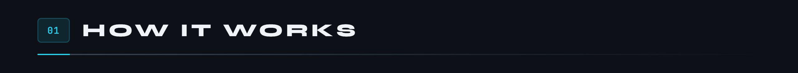
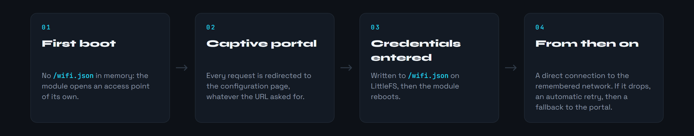
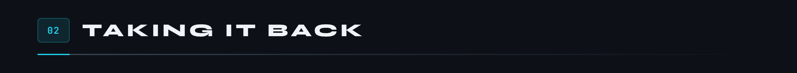
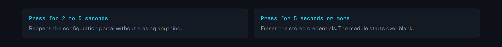
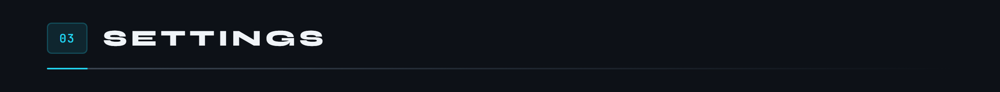
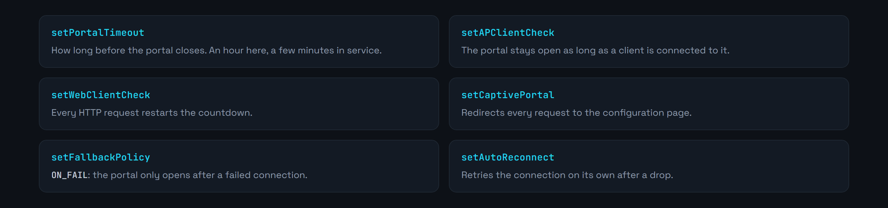
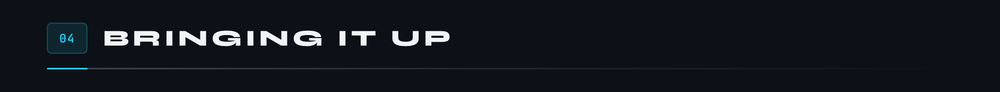
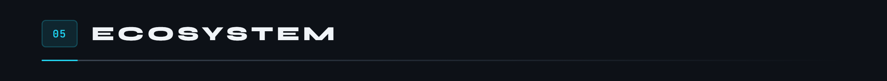

<div align="center">

<p>
  <a href="README.md"></a>
  
</p>


</div>

The common base for every MicroCoaster module. It handles getting an ESP32 onto the network: a captive portal on first boot, stored credentials, automatic reconnection, and an escape button for taking control back when the network has changed.

Every module on the layout starts from this firmware and grafts its own logic on top. What is settled here does not have to be settled anywhere else.

**Version 2.0.0**



A module has neither keyboard nor screen. The only way to hand it the credentials of a network is for it to create one itself.



The `/wifi.json` file is declared protected with the library, which keeps a filesystem operation from wiping it by accident. That is the difference between a module you reconfigure and a module you have to go and prise out of the layout.



A button on GPIO 0, the one already wired on most development boards.



It earns its keep the day the network changes name or key and the module is still looking for the old one.





An hour of portal is comfortable while developing, but generous for a module sitting in a layout: an open access point is a way in. In service, a few minutes are enough.

The access point credentials live in `include/env.h`, which is not in git. Copy [`include/env.h.example`](include/env.h.example) and fill it in: without that file the firmware does not compile, and that is deliberate. An oversight shows up at build time rather than in production.

The home network credentials never go through the code at all: they are typed into the portal and stay in `/wifi.json`, in the module's memory.



Requires [PlatformIO](https://platformio.org/) inside Visual Studio Code.

```bash
pio run                  # build
pio run -t upload        # upload the firmware
pio run -t uploadfs      # upload the portal to LittleFS
pio device monitor       # serial console, 115200 baud
```

The portal is made of static files in `data/`. They go to LittleFS with `uploadfs`, separately from the firmware: changing a page does not mean recompiling.

1. Power the module. It creates the `WifiManager-MicroCoaster` access point.
2. Connect to it and open `http://192.168.4.1`.
3. Enter the target network.
4. The module reboots and joins the network.

The serial console at 115200 baud traces every step, and a connection status is published every thirty seconds with the IP address and the signal strength.



```ini
ayresnet/AyresWiFiManager   ; captive portal, storage, reconnection
```

The library logs are turned off through `AWM_ENABLE_LOG=0` in `platformio.ini`, so the console does not mix two languages. Embedded filesystem: **LittleFS**, which holds the portal pages and `/wifi.json`.

Modules built on this base: [Switch Track](https://github.com/Microcoaster/Switch-Track), [Launch Track](https://github.com/Microcoaster/Launch-Track), [Lift Hill](https://github.com/Microcoaster/Lift-Hill), [Audio module](https://github.com/Microcoaster/Module-Audio), [Smoke Machine](https://github.com/Microcoaster/Smoke-Machine). The whole thing is driven by the [WebApp](https://github.com/Microcoaster/MicroCoasterWebApp).

---

<sub>MicroCoaster · Author: Cybertrist</sub>
