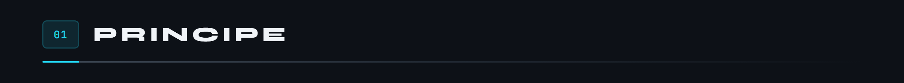
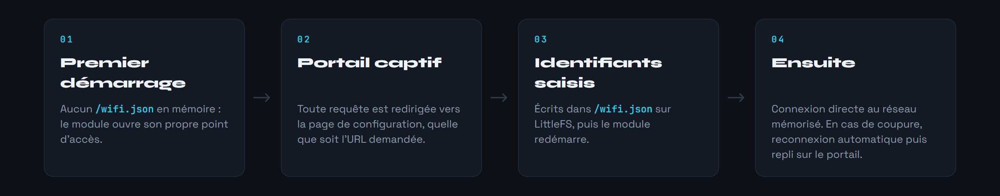
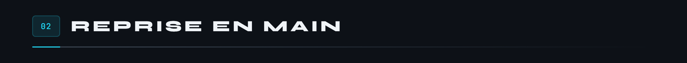
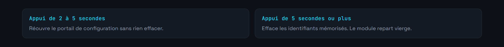
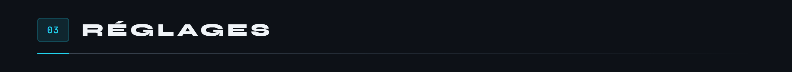
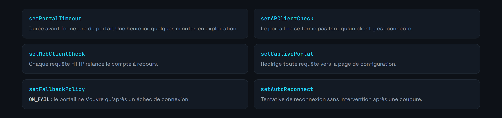
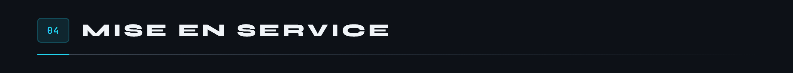
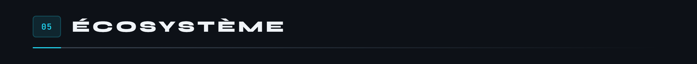

<div align="center">


</div>

Socle commun à tous les modules MicroCoaster. Il gère la mise en réseau d'un ESP32 : portail captif au premier démarrage, mémorisation des identifiants, reconnexion automatique, et un bouton de secours pour reprendre la main quand le réseau a changé.

Chaque module du circuit part de ce firmware et y greffe sa logique propre. Ce qui est réglé ici n'a pas à l'être ailleurs.

**Version 2.0.0**



Un module n'a ni clavier ni écran. La seule manière de lui donner les identifiants d'un réseau, c'est qu'il en crée un lui-même.



Le fichier `/wifi.json` est déclaré protégé auprès de la bibliothèque, ce qui empêche qu'une opération sur le système de fichiers l'efface par accident. C'est la différence entre un module qu'on reconfigure et un module qu'on doit aller déloger du circuit.



Un bouton sur GPIO 0, celui qui est déjà câblé sur la plupart des cartes de développement.



Il sert le jour où le réseau a changé de nom ou de clé et où le module, lui, cherche toujours l'ancien.





Une heure de portail est confortable pour la mise au point, mais généreux pour un module posé dans un circuit : un point d'accès ouvert est un point d'entrée. En exploitation, quelques minutes suffisent.

Les identifiants du point d'accès vivent dans `include/env.h`, qui n'est pas versionné.


```c
#define ESP_WIFI_SSID     "WifiManager-MicroCoaster"
#define ESP_WIFI_PASSWORD "<mot de passe du portail>"
```

Ceux du réseau domestique, eux, ne passent jamais par le code : ils sont saisis dans le portail et restent dans `/wifi.json`, en mémoire du module.



Nécessite [PlatformIO](https://platformio.org/) dans Visual Studio Code.


```bash
pio run                  # compilation
pio run -t upload        # téléversement du firmware
pio run -t uploadfs      # téléversement du portail vers LittleFS
pio device monitor       # console série, 115200 bauds
```

Le portail est fait de fichiers statiques dans `data/`. Ils partent sur LittleFS avec `uploadfs`, séparément du firmware : modifier une page ne demande pas de recompiler.

1. Alimenter le module. Il crée le point d'accès `WifiManager-MicroCoaster`.
2. S'y connecter et ouvrir `http://192.168.4.1`.
3. Renseigner le réseau de destination.
4. Le module redémarre et rejoint le réseau.

La console série à 115200 bauds trace chaque étape, et un état de connexion est publié toutes les trente secondes avec l'adresse IP et la puissance du signal.




```ini
ayresnet/AyresWiFiManager   ; portail captif, mémorisation, reconnexion
```

Les journaux de la bibliothèque sont désactivés par `AWM_ENABLE_LOG=0` dans `platformio.ini`, afin que la console ne mélange pas deux langues. Système de fichiers embarqué : **LittleFS**, il héberge les pages du portail et `/wifi.json`.

Modules qui partent de ce socle : [Switch Track](https://github.com/Microcoaster/Switch-Track), [Launch Track](https://github.com/Microcoaster/Launch-Track), [Lift Hill](https://github.com/Microcoaster/Lift-Hill), [Module Audio](https://github.com/Microcoaster/Module-Audio), [Smoke Machine](https://github.com/Microcoaster/Smoke-Machine). Le tout est piloté par la [WebApp](https://github.com/Microcoaster/MicroCoasterWebApp).

---

<sub>MicroCoaster · Auteur : Cybertrist</sub>
