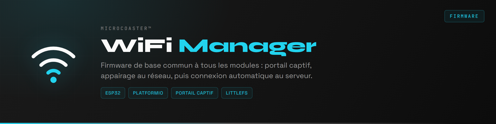

> Un gestionnaire WiFi moderne et simple pour connecter tous les modules de ton projet MicroCoaster à une application web centralisée.

## À quoi sert ce projet ?

MicroCoaster WiFiManager permet de connecter facilement chaque module de ton circuit de montagnes russes miniature (switch track, launch track, station, etc.) à un réseau WiFi local, puis à l’application web fournie. Il centralise la configuration WiFi, la gestion des accès et la communication entre les modules et l’interface web.

### Fonctionnalités principales
- **Portail de configuration WiFi** : chaque module peut être configuré via un portail web local (mode AP) pour entrer les identifiants WiFi de la box ou du réseau cible.
- **Connexion automatique** : une fois configuré, le module se connecte automatiquement au réseau WiFi domestique et communique avec l’application web.
- **Sécurité** : les identifiants WiFi ne sont jamais stockés dans le dépôt, mais dans un fichier local non versionné.
- **Gestion multi-modules** : chaque module (station, switch, launch, etc.) utilise le même firmware et peut être identifié dans l’application web.

## Utilisation

1. Flashe le firmware sur chaque module ESP32.
2. Au premier démarrage, connecte-toi au point d’accès WiFi créé par le module (ex: `WifiManager-MicroCoaster`).
3. Accède au portail de configuration (généralement http://192.168.4.1) et renseigne les identifiants de ton réseau WiFi domestique.
4. Le module redémarre et rejoint automatiquement le réseau.
5. Depuis l’application web fournie, tu peux voir, piloter et configurer chaque module connecté.

## Auteur
CyberSpaceRS

---
Pour toute question ou contribution, ouvre une issue ou un pull request !
